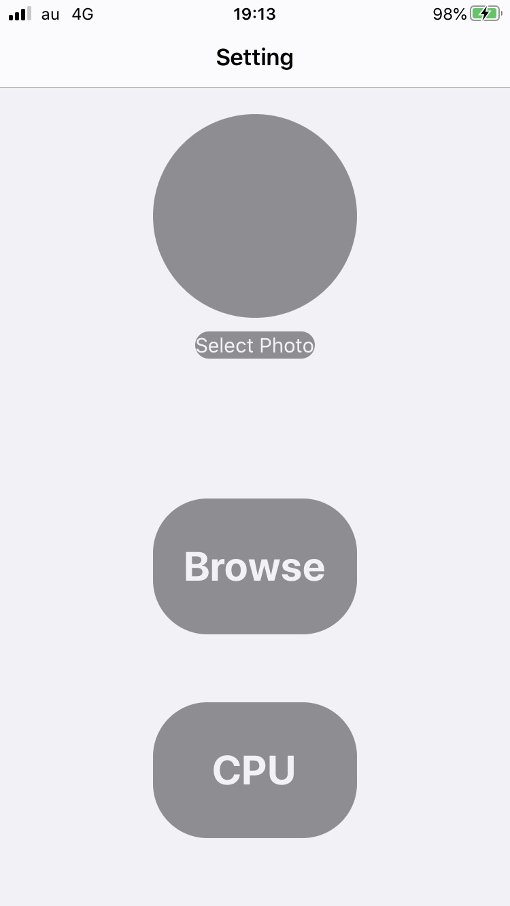
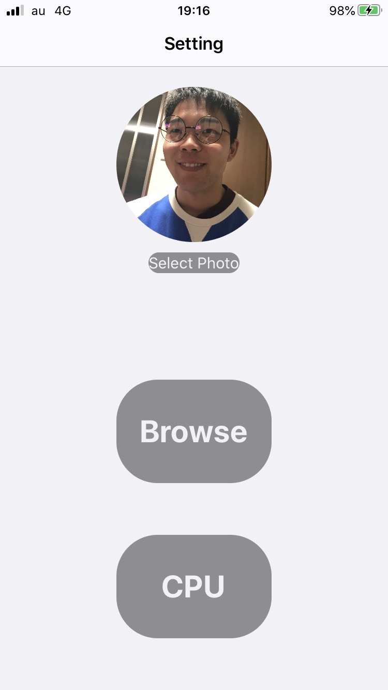
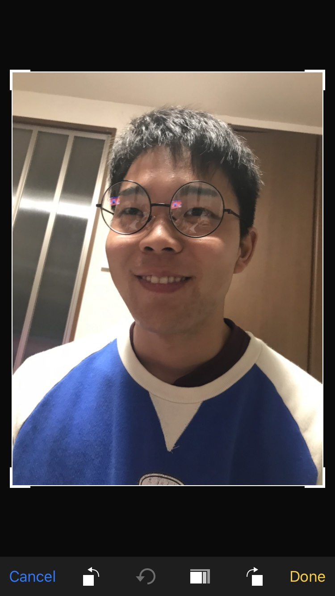
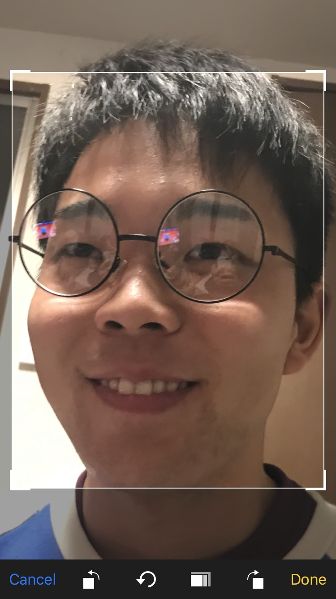
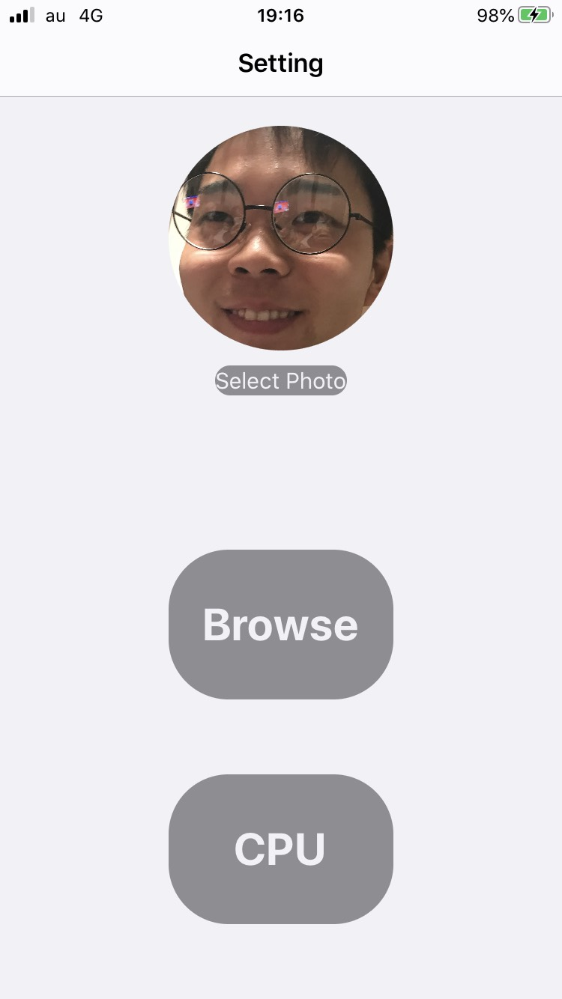
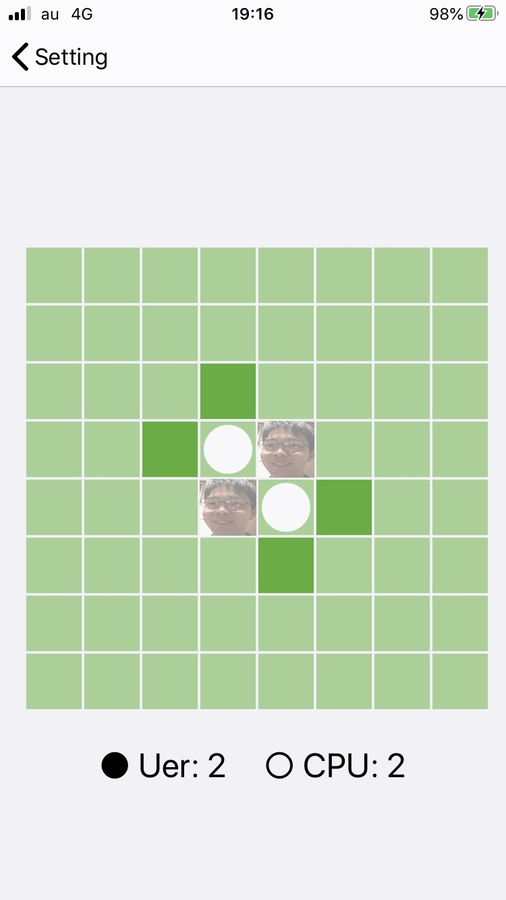
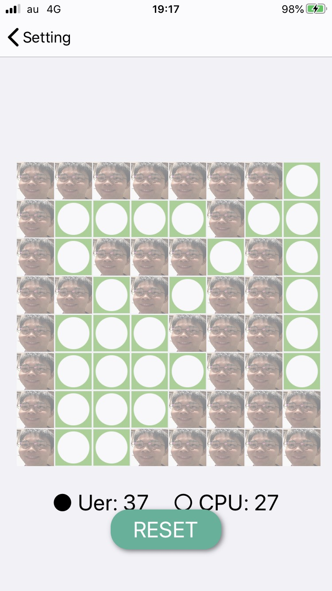

# FaceOthello
This is an app of Othello. In this game, we can use our photo as othello pieces.

Step1.
Open this app.

Step2.
Press "Select Photo" and choice your image.

Step3.
Your image is ready.

Step4.
You can arrange your image.

Step5.
If you finished the arrangement, please press "Done"(or "Cancel").

Step6.
Are you ready?

Step7.
Press "CPU" or "Browse" button and play Othello!

Step8.
How do you feel? It's a nice Othello, isn't it? :)

Then, we can start this app and pick a photo from liblary and play!

