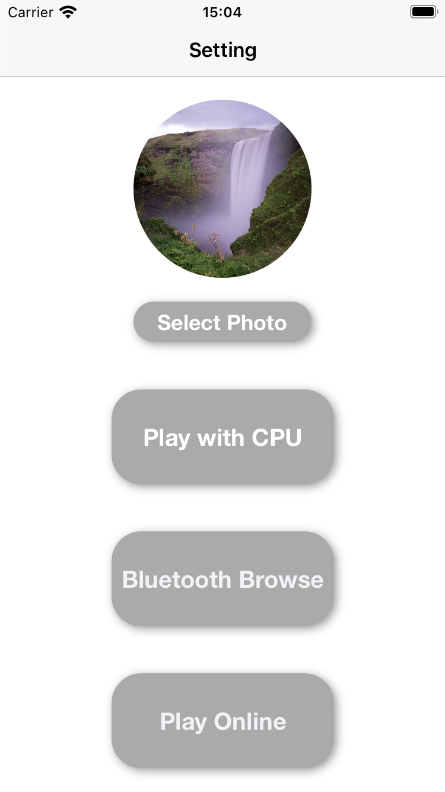
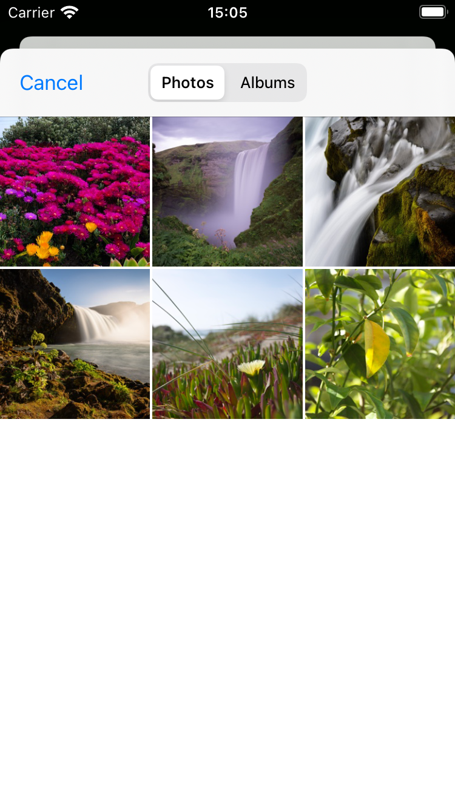
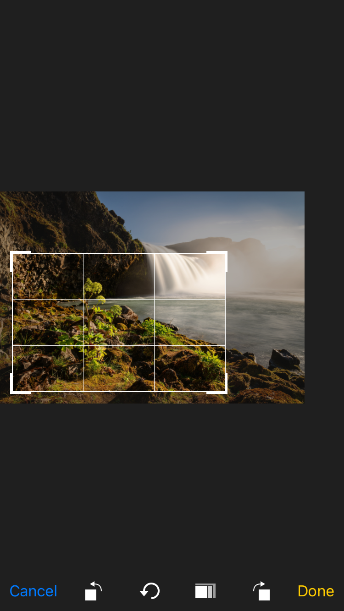
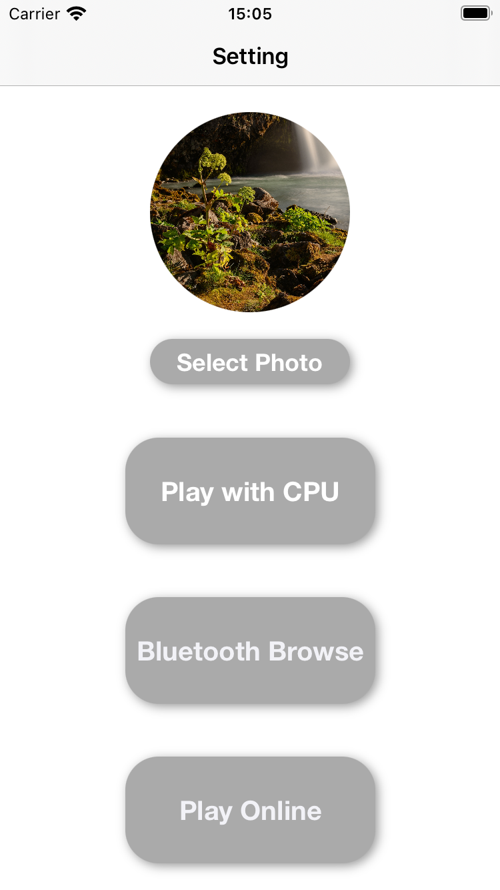
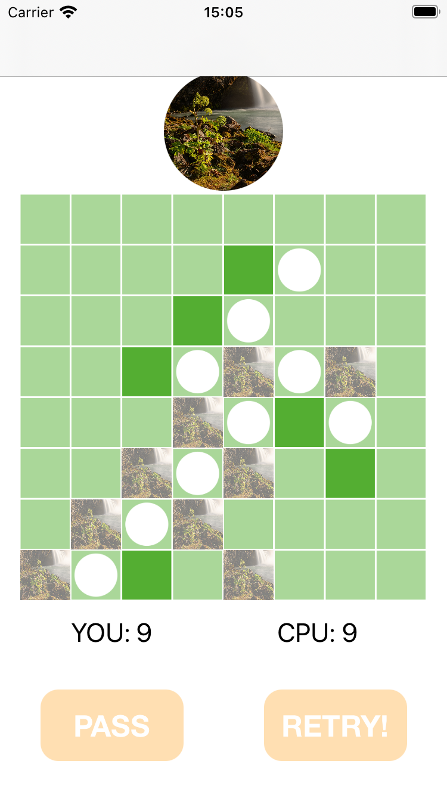

### はじめに
本プロジェクトは、Githubのデフォルトのライセンスが適用されています。(未設定のため)
ソースコードについては作者があらゆる権利を留保し、ソースコードの複製、配布、派生物の作成は誰にも許可されません。
ただし、以下の場合を除きます。
 - 作者が許可を下した第三者が扱う場合

# FaceOthello
これはオセロのアプリです。オセロってシンプルで楽しいけれど、シンプルすぎませんか？オセロの石は黒と白、これを変えてしまいましょう。このアプリでは、オセロの石に好きな写真を設定することができます。あなた好みの石で盤面を埋め尽くし、最終的に勝利しましょう！

 

Step1.
まず、アプリを開いて写真を設定しましょう。select photoボタンで端末内の写真を選びましょう。設定した写真をタップすると、写真のズーム・クロップが行えます。

 

 

Step2.
その後、3つのボタンのいずれかを押下してオセロをプレイしましょう！以下の3つの選択肢があります。

 - CPUと対戦
 - Bluetoothで対戦（未実装）
 - オンラインで対戦

それでは、暇な時間にお楽しみください。
